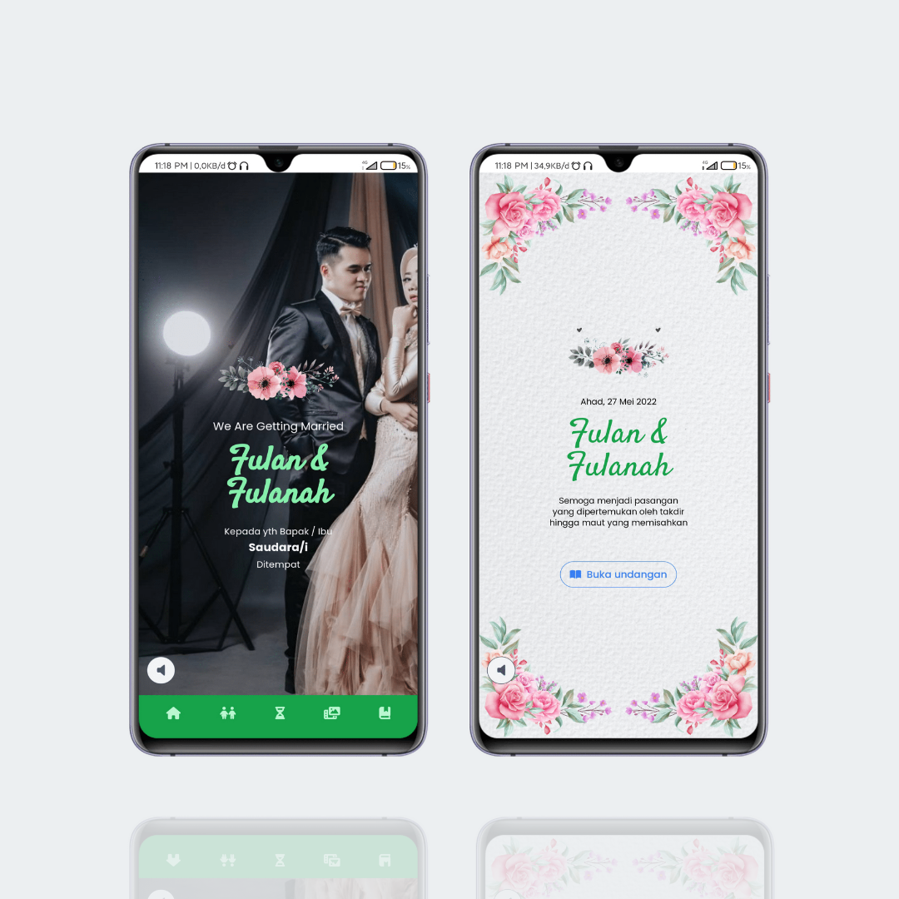

<h3 align="center">Diundang - Theme Official</h3>

Official Theme By Diundang - Digital Wedding Invitation

### Languages and Tools
- Vue JS 3
- Tailwind
- Animate CSS
- Animate On Scroll
- Vue Router
- Font Awesome 6
- Google Fonts Tangerine
- Google Fonts Open Sans
- Vue Viewer
- Vue 3 Video Player
- Vite JS
- Git 
- Github
- Vercel
- Termux
- Neovim

### Features
- [x] Countdown
- [x] Backsound
- [x] Timelines event
- [x] Map location
- [x] Quote
- [x] Love story
- [x] Guest book with Google spreadsheet
- [x] Digital envelope
- [x] Support Open Graph for facebook, twitter, and Whatsapp
- [x] Gallery
- [x] Videos
- [x] Invited guests
- [x] Couple profiles with picture

### Demo 
- [Diundang - Official Theme](http://diundang-demo-3.vercel.app)

### Thanks 
- Support me with a cup of coffee and other snacks [here ..](https://saweria.co/orabdillh)
- Don't forget to give me star in this repository 🙏🏻🙏🏻
- See my other projects on instagram [@or.abdillh](http://www.instagram.com/or.abdillh)

[Oka R Abdillah ](http://github.com/or-abdillh)
 
Last edited on : 15/05/2022

